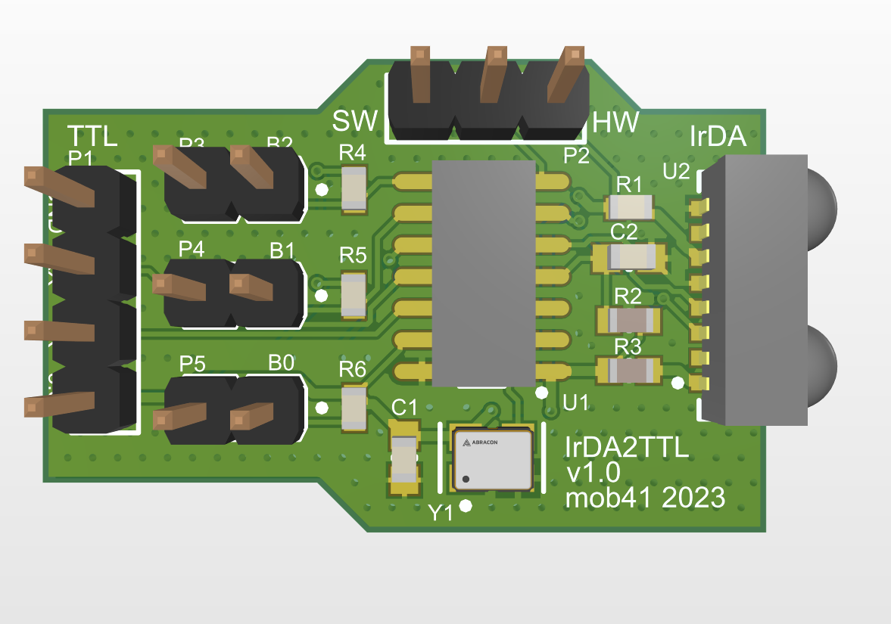

# IrDA to TTL Board
An IrDA to TTL Board created using Altium Designer 22

## Components

The board uses MCP2120 Infrared encoder/decoder IC to interface with TFDU4101 infrared transceiver module.
Design is referenced from https://download.mikroe.com/documents/add-on-boards/other/wireless-connectivity/irda-2/irda-2-board-manual-v100.pdf.

The OutJob, gerbers are set up to order PCB fabrication with JLCPCB. 

## 3D View

## License

Licensed under the [Creative Commons Attribution-ShareAlike 4.0 International](https://creativecommons.org/licenses/by-sa/4.0).